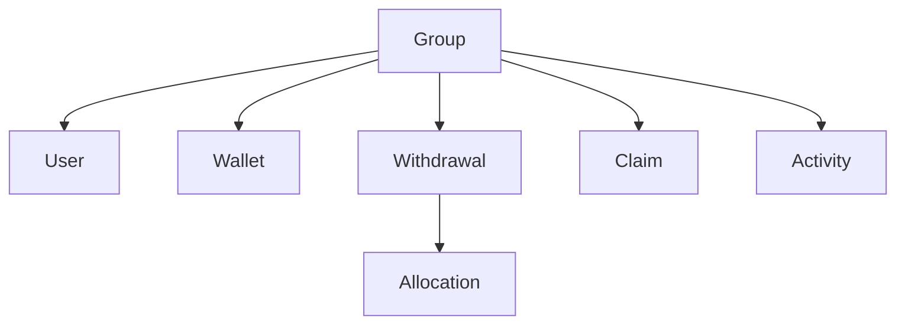
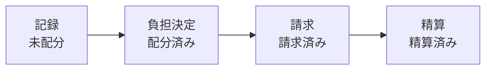
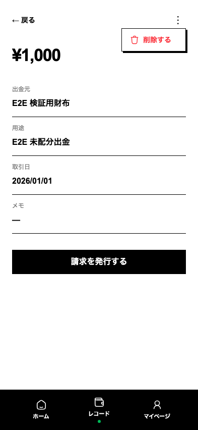
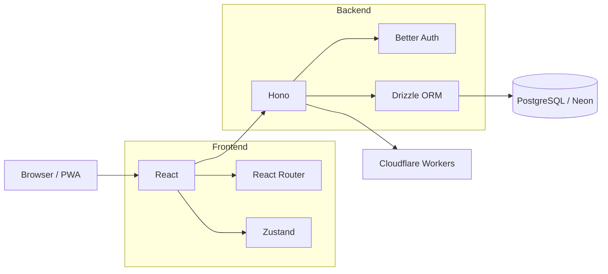

# Okaeshi

**立替を、忘れる前に記録して、あとから正しく返す。**

Okaeshiは、夫婦・家族・少人数グループで発生する立替と精算を管理するWebアプリです。

一般的な家計簿のようにすべての支出を管理するのではなく、**あとで誰かに返す・返してもらう必要がある支出だけを扱う**ことに特化しています。

## Why Okaeshi?

夫婦や家族で生活していると、こんな支払いが頻繁に発生します。

- 個人のクレジットカードで共有の日用品を購入した
- 家計用ではない口座から一時的に支払った
- 共有財布から、本来とは異なる用途の支払いをした
- 「あとで返そう」と思ったまま忘れてしまった
- 精算するときになって、どの財布へ返せばいいか分からなくなった

これらを家計簿で管理しようとすると、必要以上に多くの支出を記録することになります。

一方で、メモやチャットでは「誰が・どの財布から・いくら支払ったか」と「精算済みかどうか」を継続的に管理するのが難しくなります。

Okaeshiでは、問題を

**記録 → 負担決定 → 請求 → 精算**

という4つの段階に分けて扱います。

## Product principles

### 1. 家計簿を作らない

Okaeshiが管理するのは、すべての支出ではありません。

記録するのは、**あとから精算する必要がある支出だけ**です。

たとえば、家計用の財布から通常の食費を支払った場合は記録しません。

個人財布から共有費を立て替えた場合など、「あとでお金を戻す必要がある」ときだけ記録します。

対象を絞ることで、ユーザーが管理しなければならない情報そのものを減らしています。

### 2. まず事実だけを記録する

立替が発生した瞬間に確定しているのは、

- いくら使ったか
- どの財布から支払ったか
- 何に使ったか

といった「支出の事実」です。

一方で、

- 誰がいくら負担するのか
- 誰に請求するのか

までは、その場で決まっていないことがあります。

そこでOkaeshiでは、**出金記録と負担決定を別の操作として設計しています。**

立替時には記録だけを素早く済ませ、負担については後から落ち着いて決められます。

### 3. 記録速度を優先する

立替記録は、時間が経つほど忘れやすくなります。

そのため新規記録のUIでは、「情報を完璧に入力すること」よりも**その場で記録を残せること**を優先します。

入力順やデフォルト値、入力フォーカスなども、操作回数を減らすことを基準に設計しています。

記録時に負担決定まで要求しないのも、この考え方によるものです。

### 4. 「人」ではなく「財布へ返す」

Okaeshiでは精算を、

**立替によって減った財布へ、お金を戻すこと**

と捉えています。

たとえば妻の銀行口座から2,300円を立て替えた場合、

```text
だいち
  ↓ ¥2,300
妻銀行
```

という請求になります。

単に「妻へ2,300円返す」とするのではなく、**どの財布へ戻すべきかまで管理する**ことで、複数の銀行口座・現金・共有財布を使う家庭でも精算先を明確にしています。

## Domain model



主要なドメインは次のとおりです。

| Domain     | Role                                     |
| ---------- | ---------------------------------------- |
| Group      | メンバー・財布・出金・請求を共有する単位 |
| User       | グループを利用するユーザー               |
| Wallet     | 実際にお金を保有する単位                 |
| Withdrawal | 財布からお金が出た事実                   |
| Allocation | 出金に対する各ユーザーの負担             |
| Claim      | ユーザーから財布への返済依頼             |
| Activity   | グループ内で行われた操作履歴             |

### Withdrawal lifecycle



各段階は、情報が実際に確定するタイミングに合わせて分離しています。

#### 1. 記録

立替が発生した事実を保存します。

この時点では負担や請求を確定しません。

#### 2. 負担決定

記録された支出を確認し、各メンバーが負担する金額を決定します。

負担は割合ではなく金額で管理し、合計が出金額と一致することを保証します。

#### 3. 請求

決定した負担をもとに、ユーザーから返済先財布への請求を扱います。

ClaimはWithdrawalとは独立した集約として設計し、将来的に複数の出金をまとめた請求や月次精算にも対応できる構造にしています。

#### 4. 精算

実際に返済が行われ、対象の財布へお金が戻ったことを記録します。

## Features

現在、以下の機能を中心に開発しています。

- 認証
- グループ管理
- 個人財布・共有財布の管理
- 出金記録
- 出金記録一覧・詳細
- 負担額の設定
- 請求管理
- 精算状態の管理
- アクティビティ管理
- PWA対応

## Screenshot



## Architecture



## Tech stack

### Frontend

- React
- TypeScript
- Vite
- React Router
- Zustand
- Tailwind CSS
- Better Auth

### Backend

- Hono
- TypeScript
- Drizzle ORM
- Zod
- Better Auth
- PostgreSQL
- Neon
- Cloudflare Workers

### Testing / Quality

- Vitest
- Playwright
- ESLint
- TypeScript
- Prettier
- Husky

### Documentation

- Astro

### Monorepo

- pnpm workspace
- Turborepo

## Repository structure

```text
.
├── apps
│   ├── web          # React frontend
│   ├── backend      # Hono API / Cloudflare Workers
│   └── docs         # Product / development documentation
├── verification     # Playwright E2E scenarios
└── verification-artifacts
    └── ...          # Verification screenshots
```

プロダクト仕様やドメインルールは、実装とは別にドキュメントとして管理しています。

- [プロダクト概要・要件](./apps/docs/src/content/product/overview.md)
- [ドメインモデル](./apps/docs/src/content/product/domain.md)
- [デザインシステム](./apps/docs/src/content/product/design-system.md)
- [用語集](./apps/docs/src/content/product/glossary.md)

## Development

```bash
pnpm install
pnpm dev
```

### Build

```bash
pnpm build
```

### Lint

```bash
pnpm lint
```

### Type check

```bash
pnpm typecheck
```

### E2E verification

主要なユーザーフローについてPlaywrightによるE2E検証を行っています。

```bash
pnpm verify:payment-create
pnpm verify:records-delete
pnpm verify:wallet-delete
```

UI変更では、テストが成功するだけでなく、実際のユーザーフローをスクリーンショットでも確認できるようにしています。

## Status

Okaeshiは現在開発中です。

まずは夫婦・2人利用を中心に、実際の立替・精算で発生する摩擦を減らすことを優先して改善しています。

機能を増やすこと自体を目的にせず、**「立替を忘れず、迷わず、正しい財布へ返せること」**を基準にプロダクトを設計していきます。
