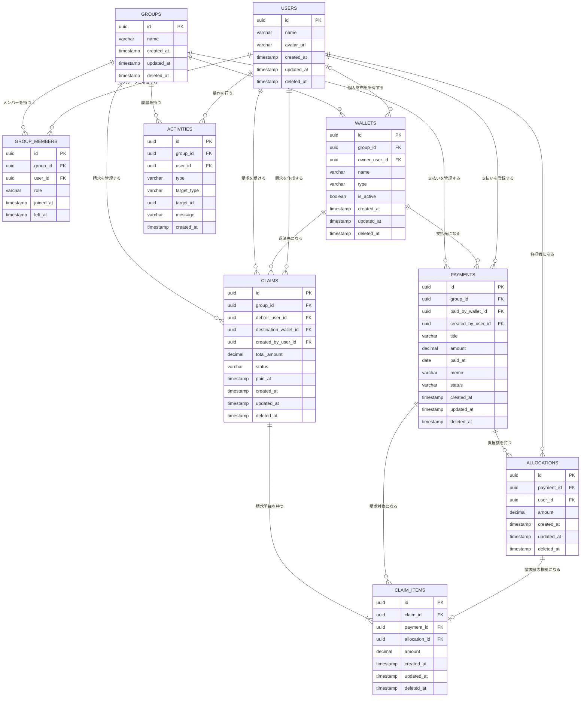

## 概要

本ドキュメントは、立替・精算管理Webアプリの主要エンティティとリレーションを定義する。

## エンティティ概要

### users

アプリを利用するユーザーを管理する。

### groups

支払い・財布・請求を共有する単位を管理する。

### group_members

ユーザーとグループの所属関係を管理する。

主なロールは以下とする。

- `owner`
- `member`

### wallets

支払元および返済先となる財布を管理する。

財布の種類は以下とする。

- `personal`: 個人財布
- `shared`: グループ共有財布

個人財布の場合は `owner_user_id` を持つ。  
グループ共有財布の場合は `owner_user_id` を持たない。

### payments

財布からお金が出た事実を管理する。

主な状態は以下とする。

- `unallocated`: 未配分
- `allocated`: 配分済み
- `claimed`: 請求済み
- `settled`: 精算済み

### allocations

支払いに対する各ユーザーの負担額を管理する。

同一支払いに紐づく負担額の合計は、支払金額と一致しなければならない。

### claims

ユーザーに対する返済依頼を管理する。

請求は「ユーザーから指定財布への返済依頼」を表し、返済元財布は管理しない。

主な状態は以下とする。

- `unpaid`: 未精算
- `paid`: 精算済み

### claim_items

請求の内訳を管理する。

1件の請求に複数の支払いをまとめられるようにする。

### activities

グループ内で発生した操作履歴を管理する。

主な種類は以下とする。

- `payment_created`
- `allocation_set`
- `claim_created`
- `settlement_completed`

## 制約・業務ルール

1. 支払いは必ず1つの財布から行われる。
2. 負担額は割合ではなく金額で管理する。
3. 1つの支払いに紐づく負担額の合計は、支払金額と一致する。
4. 請求対象はユーザー、返済先は財布とする。
5. 返済元となる財布や返済方法は管理しない。
6. 1件の請求には複数の支払いを含められる。
7. 削除対象は原則として物理削除せず、`deleted_at` または `is_active` で管理する。
8. メンバー脱退後も、過去の支払い・請求・アクティビティは保持する。
