## 概要

本アプリは、以下の流れで支払いから精算までを管理する。

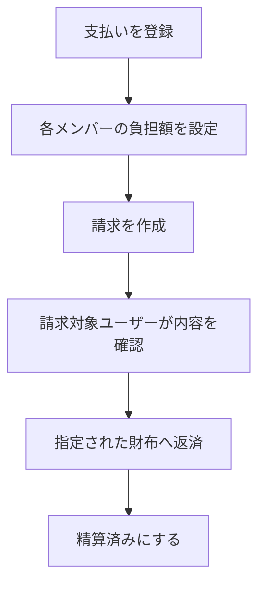

---

## 初回利用フロー

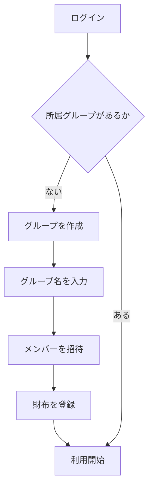

---

## グループ参加フロー

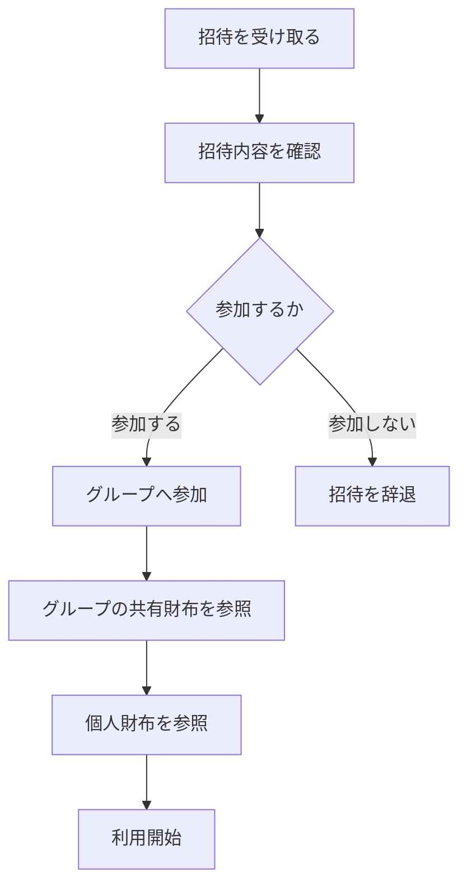

---

## 支払い登録フロー

支払い時点では、負担額や請求内容を決めない。

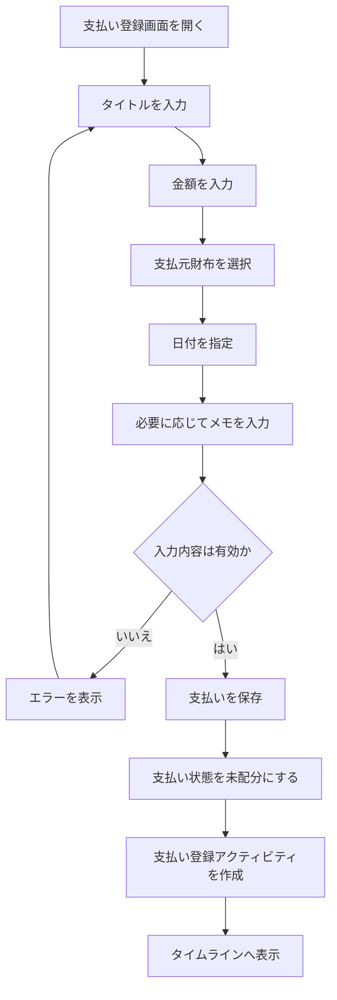

---

## 負担額設定フロー

負担は割合ではなく、各メンバーの金額で指定する。

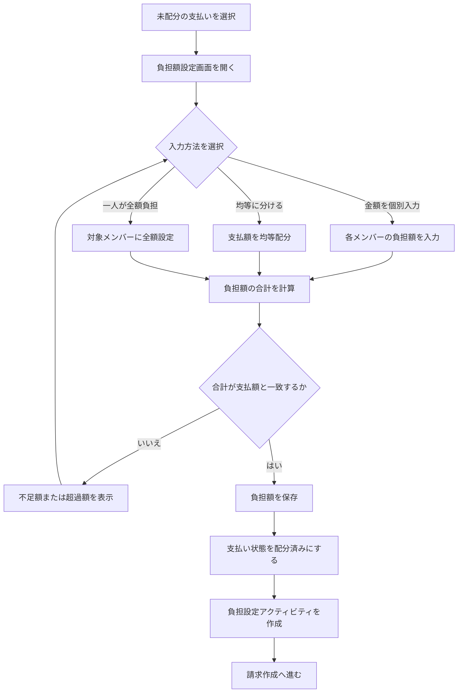

---

## 請求作成フロー

請求は「ユーザーから指定財布への返済依頼」として作成する。

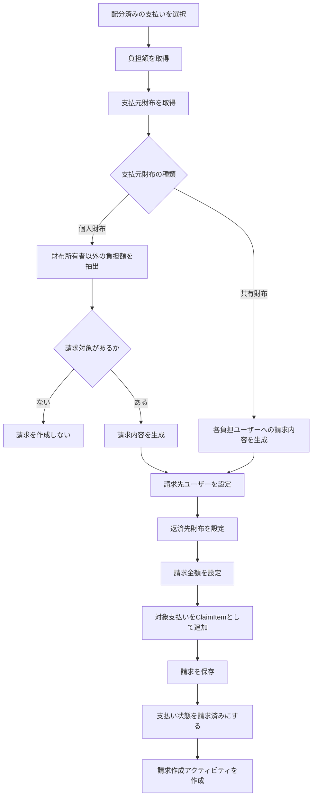

---

## 請求確認フロー

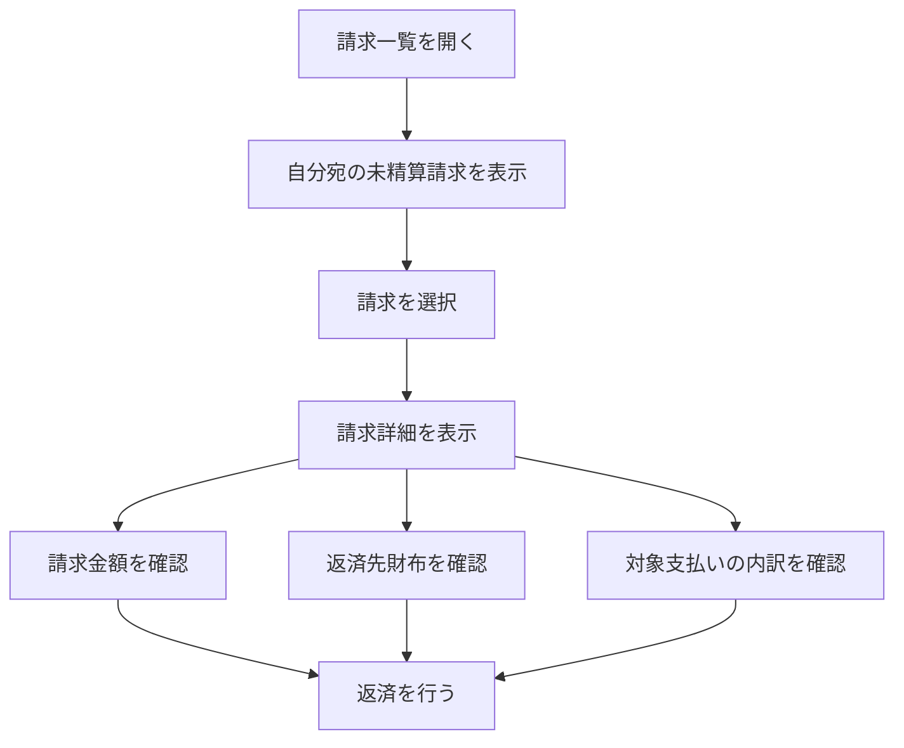

---

## 精算フロー

返済元財布はシステムで管理しない。

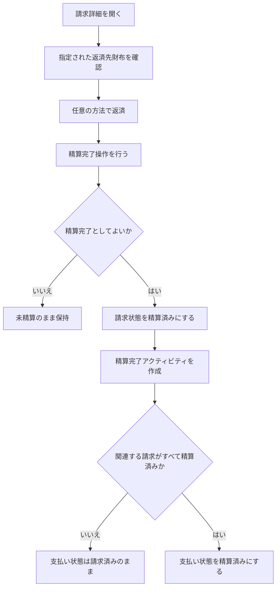

---

## 支払いライフサイクル

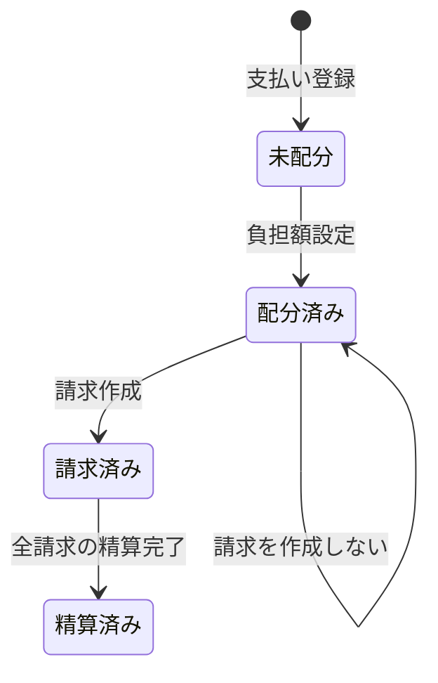

---

## 請求ライフサイクル

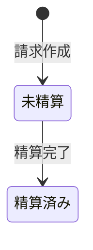

---

## アクティビティタイムライン

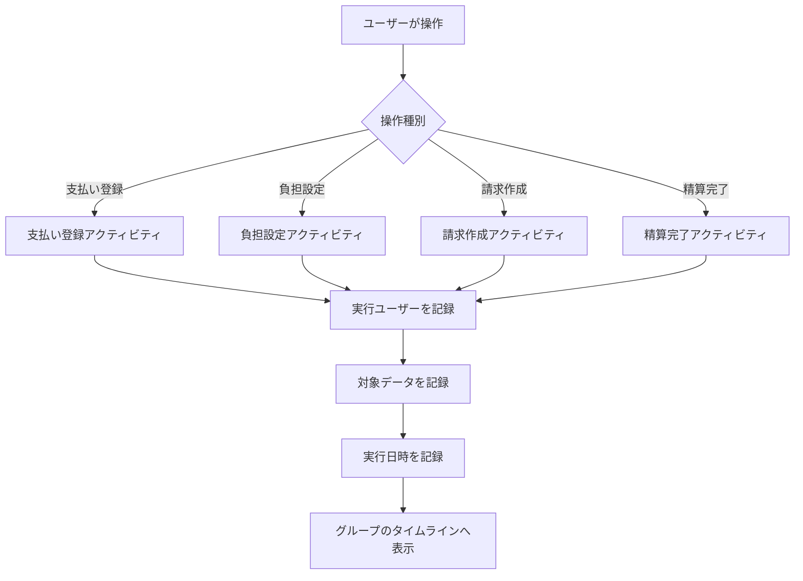

---

## 財布参照フロー

グループに所属するユーザーは、共有財布と個人財布を参照できる。

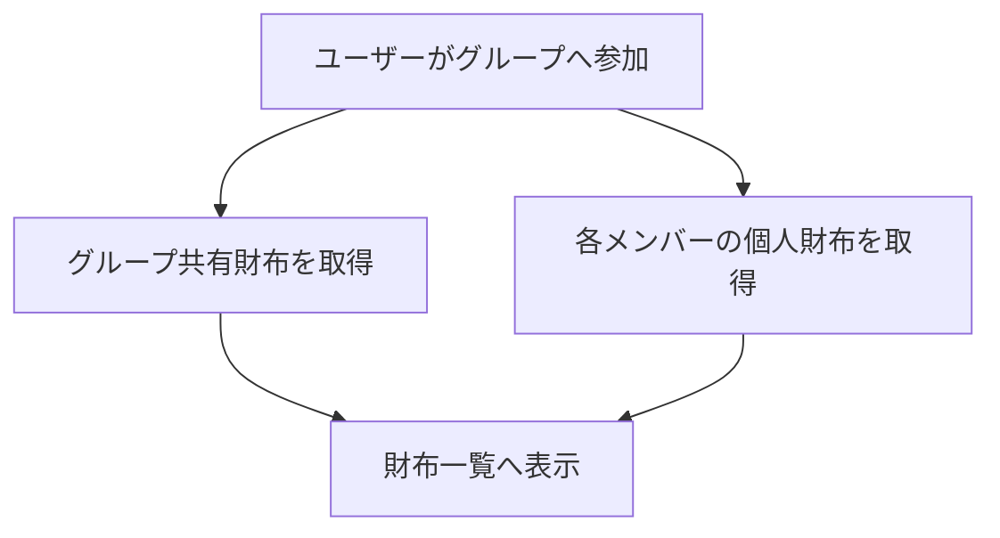

---

## メンバー削除・脱退フロー

過去の支払い・請求・アクティビティは削除しない。

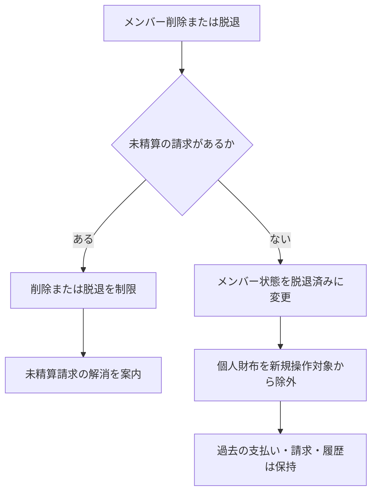
